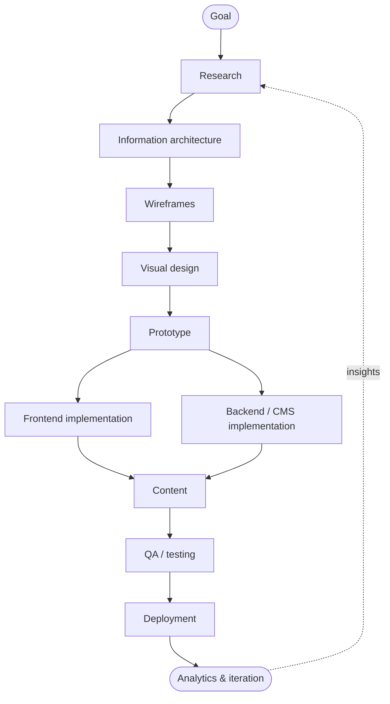

# Workflow Overview

A practical pipeline for planning, designing, building, testing, and deploying websites.

## Full pipeline

## Pick your path

=== "Solo developer"

    A shortcut for one-person projects. Skip ceremony, keep the gates that
    catch real problems.

    1. Write what the site or app should do.
    2. Make a [route map](../glossary.md#route-map).
    3. [Wireframe](../glossary.md#wireframe) the major screens.
    4. Turn the best wireframe into a polished design.
    5. Write a short [screen spec](../glossary.md#screen-spec).
    6. Use AI planning before coding.
    7. Implement one screen or component at a time.
    8. Compare output against the design.
    9. Fix spacing, states, responsiveness, and accessibility.
    10. Deploy.

=== "Professional team"

    A full team workflow adds review, design, and QA gates at each stage.

    1. [Product brief](../glossary.md#product-brief)
    2. User flows
    3. [Sitemap](../glossary.md#sitemap)
    4. [Wireframes](../glossary.md#wireframe)
    5. Visual design
    6. [Prototype](../glossary.md#prototype)
    7. Design review
    8. Frontend build
    9. Backend build
    10. Content pass
    11. QA pass
    12. Launch
    13. Measure and iterate

!!! tip "Where to go next"
    Already know the kind of site you're building? Skip to
    [Website Types](02-website-types.md) to choose the right architecture.
    Otherwise, start with [Product Planning](03-product-planning.md).
